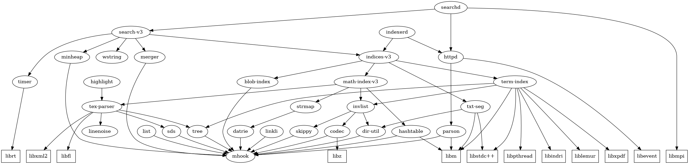

## Internals

To start describing our internals, let us make it clear on our dependency structure:



(Boxes are external dependencies, circles are internal modules)

To generate this module dependency graph, issue commands below at the project top directory:

```sh
$ mkdir -p tmp
$ python3 proj-dep.py --targets > targets.mk
$ python3 proj-dep.py --dot > tmp/dep.dot
$ dot -Tpng tmp/dep.dot > tmp/dep.png
```

Now, we will tell the story by walking through the key modules here.

### TeX Parser
TeX parser converts TeX to Operator Tree (or OPT) and leaf-root paths. There are many details involved, among them
* Each node in OPT will be assigned a ID in a way that leaf nodes always occupy lower space
* Each node in OPT will save its position [start, end] information from original TeX string
* Fingerprint (or `fp`) (the symbol hash digested from 4 nodes on top of a node) is generated for each leaf-root path
* A subtree Hash is generated for each subtree
* A pathID and a leafID (starting from 1) are generated for each path, initially they are the same
* Max pathID/leafID is also the maximum number of leaf-root paths here, they are no greater than MAX_SUBPATH_ID = 64
* Any *nil* node will be pruned
* Each *meaningful* internal node (non-meaningful are tokens like `T_BASE`, `T_SUBSCRIPT`, `T_SUPSCRIPT` or `T_NIL`) gets assigned a pathID which is the pathID from one of its descendant leaf child. Also, non-meaningful nodes are not counted when generating fingerprint.
* A rank number will be assigned to its children if a node is non-communitive node (such as fraction operator)

The following is an example output for expression `$a + a + b/c=$`

(notice the RHS has nothing so it will reduce into *nil*)
```
Operator tree:
     └──(equal) #6, token=GTLS, subtr_hash=`28392', pos=[0, 15].                                                               
           └──(plus) #7, token=ADD, subtr_hash=`23672', pos=[0, 15].                                                           
                 │──(pos) #8, token=SIGN, subtr_hash=`26696', pos=[0, 1].                                                      
                 │     └──(hanger) #9, token=HANGER, subtr_hash=`4808', pos=[0, 1].                                            
                 │           └──(base) #10, token=BASE, subtr_hash=`1160', pos=[0, 1].                                         
                 │                 └──[normal`a'] #1, token=VAR, subtr_hash=`a', pos=[0, 1].                                   
                 │──(pos) #11, token=SIGN, subtr_hash=`26696', pos=[4, 5].                                                     
                 │     └──(hanger) #12, token=HANGER, subtr_hash=`4808', pos=[4, 5].                                           
                 │           └──(base) #13, token=BASE, subtr_hash=`1160', pos=[4, 5].                                         
                 │                 └──[normal`a'] #2, token=VAR, subtr_hash=`a', pos=[4, 5].                                   
                 │──(pos) #14, token=SIGN, subtr_hash=`25732', pos=[8, 11].                                                    
                 │     └──(frac) #15, token=FRAC, subtr_hash=`57044', pos=[8, 11].                                             
                 │           │──#1(hanger) #16, token=HANGER, subtr_hash=`4820', pos=[8, 9].                                   
                 │           │     └──(base) #17, token=BASE, subtr_hash=`1164', pos=[8, 9].                                   
                 │           │           └──[normal`b'] #3, token=VAR, subtr_hash=`b', pos=[8, 9].                             
                 │           └──#2(hanger) #18, token=HANGER, subtr_hash=`4832', pos=[10, 11].                                 
                 │                 └──(base) #19, token=BASE, subtr_hash=`1168', pos=[10, 11].                                 
                 │                       └──[normal`c'] #4, token=VAR, subtr_hash=`c', pos=[10, 11].                           
                 └──(pos) #20, token=SIGN, subtr_hash=`26876', pos=[14, 15].                                                   
                       └──(hanger) #21, token=HANGER, subtr_hash=`4844', pos=[14, 15].                                         
                             └──(base) #22, token=BASE, subtr_hash=`1172', pos=[14, 15].                                       
                                   └──[normal`d'] #5, token=VAR, subtr_hash=`d', pos=[14, 15].

4 leaf-root paths:
- [path#1, leaf#1] normal`a': VAR(#1)/BASE(#10)/HANGER(#9)/SIGN(#8)/ADD(#7)/GTLS(#6) (fp 3552)                                 
- [path#2, leaf#2] normal`a': VAR(#2)/BASE(#13)/HANGER(#12)/SIGN(#11)/ADD(#7)/GTLS(#6) (fp 3552)                               
- [path#3, leaf#3] normal`b': VAR(#3)/BASE(#17)/HANGER(#16)/rank1(#0)/FRAC(#15)/SIGN(#14)/ADD(#7)/GTLS(#6) (fp 0552)           
- [path#4, leaf#4] normal`c': VAR(#4)/BASE(#19)/HANGER(#18)/rank2(#0)/FRAC(#15)/SIGN(#14)/ADD(#7)/GTLS(#6) (fp 0552)           
- [path#5, leaf#5] normal`d': VAR(#5)/BASE(#22)/HANGER(#21)/SIGN(#20)/ADD(#7)/GTLS(#6) (fp 3552) 
```

You can find the interface `tex_parse()` at `tex-parser/tex-parser.h`
```c
struct tex_parse_ret {
    uint32_t         code;
    char             msg[MAX_PARSER_ERR_STR];
    struct subpaths  lrpaths;
    void            *operator_tree;
};

struct tex_parse_ret tex_parse(const char *); 
```
(the word *subpath* refers to a full length leaf-root path or any paritial path)

### Math Index
The `math_index_add()` interface at `math-index-v3/math-index.h`
```c
size_t math_index_add(math_index_t, doc_id_t docID, exp_id_t expID, struct subpaths);
```
will take a specified docID, expID and parser generated leaf-root paths from a math formula,
to generate a *subpath set* which consists of all possible [1] leaf-to-internal-node subpaths (or *prefix paths*)
from that subpath set (exclude those rooted at a RANK node), and group them by their path token sequence.
Multiple prefix paths falling into same group are called to contain *duplicates*.

Within each group, if a subgroup of paths have the same root-end nodeID, they are called a *sector tree* because
they must have identical length and the same token sequence.
However, the leaf symbols in a sector tree may vary, alternatively, we say they may contain different *splits*.
The size of a sector tree or a split is referred as *width*.

Math indexer will ensure that the number of generated sector trees is no greater than `MAX_SUBPATHS` and it will
remove those excessive paths starting from the longest.

An example subpath set generated from above example leaf-root paths:
```
subpath set (size=13)
[  0] prefix/VAR/BASE (4 duplicates: r10~l1 r13~l2 r17~l3 r19~l4 r22~l5 )
         qnode#10/1-0003{ normal`a'/1 0x1 } 
         qnode#13/1-0003{ normal`a'/1 0x2 } 
         qnode#17/1-0003{ normal`b'/1 0x4 } 
         qnode#19/1-0003{ normal`c'/1 0x8 } 
         qnode#22/1-0003{ normal`d'/1 0x10 } 
[  1] prefix/VAR/BASE/HANGER (4 duplicates: r9~l1 r12~l2 r16~l3 r18~l4 r21~l5 )
         qnode#9/1-0035{ normal`a'/1 0x1 } 
         qnode#12/1-0035{ normal`a'/1 0x2 } 
         qnode#16/1-0030{ normal`b'/1 0x4 } 
         qnode#18/1-0030{ normal`c'/1 0x8 } 
         qnode#21/1-0035{ normal`d'/1 0x10 } 
[  2] prefix/VAR/BASE/HANGER/SIGN (2 duplicates: r8~l1 r11~l2 r20~l5 )
         qnode#8/1-0355{ normal`a'/1 0x1 } 
         qnode#11/1-0355{ normal`a'/1 0x2 } 
         qnode#20/1-0355{ normal`d'/1 0x10 } 
[  3] prefix/VAR/BASE/HANGER/SIGN/ADD (2 duplicates: r7~l1 r7~l2 r7~l5 )
         qnode#7/3-3552{ normal`a'/2 0x3 normal`d'/1 0x10 } 
[  4] prefix/VAR/BASE/HANGER/rank1/FRAC (0 duplicates: r15~l3 )
         qnode#15/1-3055{ normal`b'/1 0x4 } 
[  5] prefix/VAR/BASE/HANGER/rank2/FRAC (0 duplicates: r15~l4 )
         qnode#15/1-3055{ normal`c'/1 0x8 } 
[  6] prefix/VAR/BASE/HANGER/SIGN/ADD/GTLS (2 duplicates: r6~l1 r6~l2 r6~l5 )
         qnode#6/3-3552{ normal`a'/2 0x3 normal`d'/1 0x10 } 
[  7] prefix/VAR/BASE/HANGER/rank1/FRAC/SIGN (0 duplicates: r14~l3 )
         qnode#14/1-0552{ normal`b'/1 0x4 } 
[  8] prefix/VAR/BASE/HANGER/rank2/FRAC/SIGN (0 duplicates: r14~l4 )
         qnode#14/1-0552{ normal`c'/1 0x8 } 
[  9] prefix/VAR/BASE/HANGER/rank1/FRAC/SIGN/ADD (0 duplicates: r7~l3 )
         qnode#7/1-0552{ normal`b'/1 0x4 } 
[ 10] prefix/VAR/BASE/HANGER/rank2/FRAC/SIGN/ADD (0 duplicates: r7~l4 )
         qnode#7/1-0552{ normal`c'/1 0x8 } 
[ 11] prefix/VAR/BASE/HANGER/rank1/FRAC/SIGN/ADD/GTLS (0 duplicates: r6~l3 )
         qnode#6/1-0552{ normal`b'/1 0x4 } 
[ 12] prefix/VAR/BASE/HANGER/rank2/FRAC/SIGN/ADD/GTLS (0 duplicates: r6~l4 )
         qnode#6/1-0552{ normal`c'/1 0x8 }
```

For instance, the sixth item of subpath set has 3 prefix paths of token

`/VAR/BASE/HANGER/SIGN/ADD/GTLS`

and there is one sector tree rooted at node#6 with width=3:
```
[  6] prefix/VAR/BASE/HANGER/SIGN/ADD/GTLS (2 duplicates: r6~l1 r6~l2 r6~l5 )
         qnode#6/3-3552{ normal`a'/2 0x3 normal`d'/1 0x10 } 
```
where `3552` is fingerprint (or `ophash`) of that sector tree, and it contains two splits:
Those have leaf `a` with width=2, and a path with leaf `d` has width=1.
Here `0x3` and `0x10` are 64-bit mask to represent corresponding leaf/leaves.

A sector tree is the primary index item in math inverted list (they are mapped by their
token sequences), it contains minimal information to test structure differences between
two operator trees in a efficient way.

And the splits from a sector tree is indexed in a separate list called *symbinfo* list in
which symbol information are stored to test symbolic similarity between math formulas to
break tie similarity scores if their structures are not dramatically different.

Here is the C code snippet defining the math inverted list structure and its corresponding symbinfo list:
```c
/* math inverted list items */
struct math_invlist_item {
	/* 8-byte global key */
	uint32_t docID; /* 4 bytes */
	union {
		uint32_t secID;
		struct {
			uint16_t sect_root;
			uint16_t expID;
		};
	}; /* 4 bytes */

	uint8_t  sect_width;
	uint8_t  orig_width;
	/* padding 16 bits here */
	uint32_t symbinfo_offset; /* pointing to symbinfo file offset */
	/* 4 bytes */
}; /* 4 x 4 = 16 bytes in total */

#define MAX_INDEX_EXP_SYMBOL_SPLITS 8

struct symbsplt {
	uint16_t symbol;
	uint8_t  splt_w;
};

struct symbinfo {
	uint32_t ophash:24;
	uint32_t n_splits:8;

	struct symbsplt split[MAX_INDEX_EXP_SYMBOL_SPLITS];
};
```

[1]: Note the huge number of prefix paths can be a great overhead, so they are usually statically pruned in practice
(if search does not require to be *rank-safe*). The criteria is to test if a path root-end has a width less than
"root_width times `MATH_INDEX_STATIC_PRUNING_FACTOR`".

### Further Details
Some academic papers/posters describe in detail what our search
methods are. You may find useful to read these resources:

1. [ECIR16 Slides](https://github.com/tkhost/tkhost.github.io/raw/master/opmes/ECIR16-OPMES-slides-handouts.pdf)
2. [ECIR16 Poster](https://github.com/tkhost/tkhost.github.io/raw/master/opmes/ECIR16-Wei-Poster-publish.pdf)
3. [ECIR16 Demo](https://github.com/tkhost/tkhost.github.io/blob/master/opmes/ecir2016.pdf)
4. [Master thesis](https://github.com/tkhost/tkhost.github.io/raw/master/opmes/thesis-ref.pdf)
5. [ECIR19 Paper on Structure search model](https://ecir2019.org/accepted-papers/)
6. [ECIR20 Paper on Formula query efficiency](https://drive.google.com/open?id=1QjKVpgsTAIMLqrIDhdDOHvDa7sLvoxq7)
